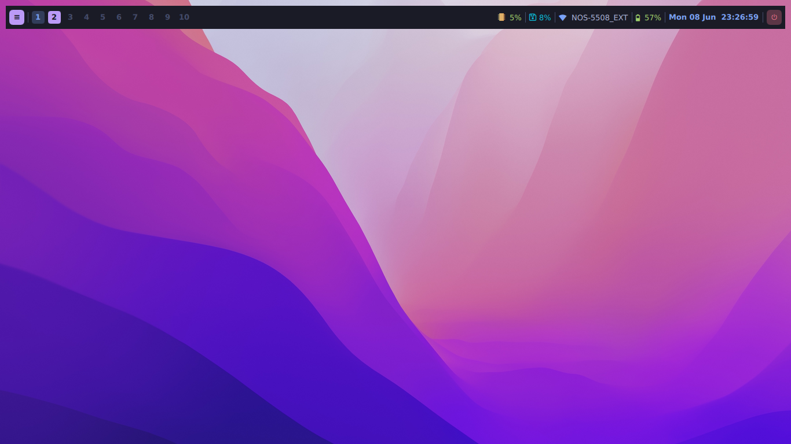

# quickshell-d77

d77-shell is a simple QT desktop shell built on top of Quickshell.



To install:

1 - Clone the Repository

```
git clone https://github.com/dani-77/quickshell-d77.git ~/.config/quickshell
```

2 - Execute the shell

```
qs -p ~/.config/quickshell/shell.qml
```

## Native application launcher

The shell ships with a built-in application launcher (Rofi/Fuzzel style),
written entirely in QML — no external dependencies. It is already wired into
`shell.qml`:

- Click the purple launcher button on the left of the bar, **or**
- Trigger it from a Hyprland keybind via IPC (see below).

Detailed module documentation lives in [`launcher/README.md`](launcher/README.md).

## Native lockscreen

The shell also bundles a native **lockscreen** module (folder `lockscreen/`, adapted
from [quickshell-examples](https://github.com/quickshell-mirror/quickshell-examples)),
written entirely in QML and themed to match the rest of the shell (Tokyo Night). It
uses a real `WlSessionLock` and validates the password through **PAM**, so the screen
stays genuinely locked until a valid password is typed.

- Lock it from the **session menu** (the "Lock" entry), **or**
- Trigger it from a Hyprland keybind via IPC (see below, suggested `SUPER + L`).

Detailed module documentation lives in [`lockscreen/README.md`](lockscreen/README.md).

## Native OSD (volume & brightness)

The shell also bundles a native **OSD** module (folder `osd/`, adapted from
[quickshell-examples → volume-osd](https://github.com/quickshell-mirror/quickshell-examples/tree/master/volume-osd)).
A minimalist overlay (icon + progress bar + value) pops up in the **top-right corner**
whenever the volume or screen brightness changes, and fades out after ~2.5 s.

- **Volume** uses the **ALSA** backend (`amixer`) with **mute/unmute** support.
- **Brightness** uses **brightnessctl**.

Trigger it from your media keys via IPC (see below). A background watcher also catches
*external* changes (e.g. another app changing the volume) and shows the OSD anyway.

Detailed module documentation lives in [`osd/README.md`](osd/README.md).

## Controlling the shell via IPC (recommended)

`shell.qml` exposes three Quickshell `IpcHandler` targets so the launcher, the
session menu and the lockscreen can be triggered from anywhere while the shell is
running:

| Target       | Functions                 | What it does                              |
|--------------|---------------------------|-------------------------------------------|
| `launcher`   | `toggle`, `open`, `close` | Show/hide the application launcher        |
| `session`    | `toggle`, `open`, `close` | Show/hide the session menu (lock/suspend/reboot/shutdown/logout) |
| `lockscreen` | `lock`, `unlock`, `toggle` | Lock the screen (PAM) / unlock / alternate |
| `osd`        | `volumeUp`, `volumeDown`, `volumeMuteToggle`, `brightnessUp`, `brightnessDown`, `showVolume`, `showBrightness` | Volume (ALSA, with mute) & brightness (brightnessctl) OSD |

Call them from the command line:

```bash
qs ipc call launcher toggle     # toggle the launcher
qs ipc call launcher open       # open the launcher
qs ipc call launcher close      # close the launcher

qs ipc call session toggle      # toggle the session menu
qs ipc call session open        # open the session menu
qs ipc call session close       # close the session menu

qs ipc call lockscreen lock     # lock the screen (asks for password via PAM)
qs ipc call lockscreen unlock   # unlock without a password
qs ipc call lockscreen toggle   # alternate locked/unlocked

qs ipc call osd volumeUp           # volume +5% (shows the OSD)
qs ipc call osd volumeDown         # volume -5%
qs ipc call osd volumeMuteToggle   # mute / unmute
qs ipc call osd brightnessUp       # brightness +5%
qs ipc call osd brightnessDown     # brightness -5%

qs ipc show                     # list every target/function exposed
```

### OSD keybinds (media keys)

Bind your media keys in `hyprland.conf` (`bindel` repeats while held; `bindl` works
even while the screen is locked):

```ini
bindel = , XF86AudioRaiseVolume,  exec, qs ipc call osd volumeUp
bindel = , XF86AudioLowerVolume,  exec, qs ipc call osd volumeDown
bindl  = , XF86AudioMute,         exec, qs ipc call osd volumeMuteToggle
bindel = , XF86MonBrightnessUp,   exec, qs ipc call osd brightnessUp
bindel = , XF86MonBrightnessDown, exec, qs ipc call osd brightnessDown
```

### Hyprland keybinds (IPC)

This is the most reliable way to bind the shell — especially with **Lua-generated
Hyprland configs (Hyprland 0.46+)**, where the `global` dispatcher tends to be
fragile. Add to your `hyprland.conf`:

```ini
bind = SUPER, D, exec, qs ipc call launcher toggle      # application launcher
bind = SUPER SHIFT, E, exec, qs ipc call session toggle # session menu
bind = SUPER, L, exec, qs ipc call lockscreen lock      # lock the screen
```

Reload Hyprland (`hyprctl reload`) and press the keybind.

> 📖 Full keybind setup — including **Hyprland with Lua** (generating
> `hyprland.conf`, `init.lua`, `hyprctl keyword`, `source`) and how to verify the
> IPC targets (`qs ipc show`) — is in [`KEYBINDS.md`](KEYBINDS.md).

### Global shortcuts (fallback)

`shell.qml` also keeps three Quickshell `GlobalShortcut`s (`launcher`, `session` and
`lock`) as a fallback. To use them instead of IPC:

```ini
bind = SUPER, D, global, quickshell:launcher      # application launcher
bind = SUPER SHIFT, E, global, quickshell:session # session menu
bind = SUPER, L, global, quickshell:lock          # lock the screen
```

The format is `<appid>:<name>` (default `appid` is `quickshell`). See
[`KEYBINDS.md`](KEYBINDS.md) for details.

### Launcher keybindings

| Key                | Action                          |
|--------------------|---------------------------------|
| Type               | Filter the application list     |
| `↑` / `↓`          | Move the selection              |
| `Tab`              | Next item                       |
| `Enter`            | Launch the selected application |
| `Esc` / click out  | Close the launcher              |

### Lockscreen keybindings

| Key        | Action                                   |
|------------|------------------------------------------|
| Type       | Enter your password                      |
| `Enter`    | Submit and try to unlock (via PAM)       |
| Click `Unlock` | Submit and try to unlock             |

Enjoy
