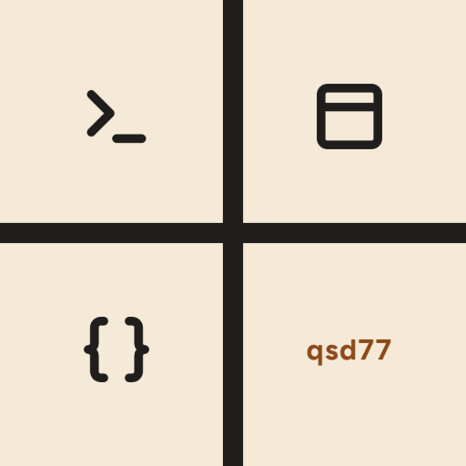
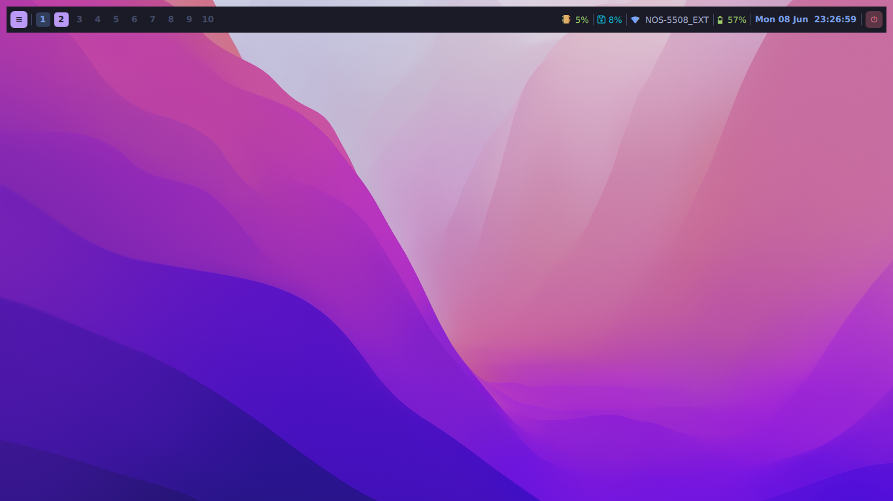

<p align="center">
  
</p>

<h1 align="center">quickshell-d77</h1>

<p align="center">
  A complete desktop shell for Wayland — bar, app launcher, lockscreen, login screen,
  wallpaper picker, volume/brightness popup and a local AI chat — built with
  <a href="https://quickshell.org">Quickshell</a> and themed in Tokyo Night.
</p>

<p align="center">
  
</p>

---

## What is this?

quickshell-d77 replaces your bar, launcher, lockscreen and other desktop bits with a
single, consistent set of panels — no mixing and matching Waybar, Rofi, swaylock and a
dozen scripts. It works out of the box on **Hyprland**, **Sway** and **niri**, and
degrades gracefully on other Wayland compositors.

What you get:

- **A top bar** — workspaces, clock, tray, quick buttons.
- **An app launcher** — type to search, `Enter` to launch.
- **A lockscreen** — locks your session for real (PAM password check).
- **A login screen (greeter)** — optional, replaces your display manager.
- **A volume/brightness popup (OSD)** — pops up automatically when you use media keys.
- **A wallpaper picker** — browse and apply wallpapers, restored automatically on login.
- **A dashboard** — quick system stats, weather, music controls, power options.
- **An AI chat popup** — talks to a local [Ollama](https://ollama.com) install, no cloud
  needed.

Everything is controlled the same way: click a button on the bar, or bind it to a key
in your compositor's config.

## Before you install

You need [Quickshell](https://quickshell.org) itself installed and working first —
this repository is a *configuration* for it, not a replacement.

Some panels also expect the usual Wayland desktop tools to be present, depending on
which ones you use: `brightnessctl` (brightness OSD), `amixer`/ALSA (volume OSD), a
wallpaper daemon such as `swww`/`hyprpaper`/`swaybg` (wallpaper picker), and
[Ollama](https://ollama.com) running locally (AI chat). Nothing breaks if one of these
is missing — that one feature just won't do anything until it's installed.

## Installing

```sh
git clone https://github.com/dani-77/quickshell-d77.git ~/.config/quickshell
```

Then start it:

```sh
qs -p ~/.config/quickshell/shell.qml
```

Most people instead add that as an autostart line in their compositor's config, so it
launches automatically on login — for example in `hyprland.conf`:

```ini
exec-once = qs -p ~/.config/quickshell/shell.qml
```

## Using it

Once it's running, everything is reachable from the bar with the mouse:

- Click the **launcher button** to open the app launcher.
- Click the **session button** to lock the screen, suspend, reboot or log out.
- Click the **wallpaper button** to browse and apply wallpapers.
- Click the **AI button** to open the chat popup.
- Change volume/brightness with your usual media keys — a small popup confirms it.

For keyboard shortcuts (recommended, so you don't need the mouse for any of this), bind
a few keys in your compositor's config to call the shell directly:

```ini
# ~/.config/hypr/hyprland.conf
bind = SUPER, D, exec, qs ipc call launcher toggle      # app launcher
bind = SUPER SHIFT, E, exec, qs ipc call session toggle # session menu
bind = SUPER, L, exec, qs ipc call lockscreen lock      # lock the screen
bind = SUPER, Y, exec, qs ipc call wallpaper toggle     # wallpaper picker
```

```text
# ~/.config/sway/config
bindsym $mod+d exec qs ipc call launcher toggle
bindsym $mod+Shift+e exec qs ipc call session toggle
bindsym $mod+l exec qs ipc call lockscreen lock
bindsym $mod+y exec qs ipc call wallpaper toggle
```

> 💡 Prefer a shorter command? [`qsd77`](https://github.com/dani-77/qsd77) wraps all of
> this into plain commands like `qsd77 launcher` instead of the full `qs ipc call ...`
> line above.

## More

- Full command reference (every panel, every IPC target, Hyprland keybind setup with
  `GlobalShortcut`) — [`doc/README.md`](doc/README.md) and [`KEYBINDS.md`](KEYBINDS.md).
- Setting up the login screen — [`greeter/README.md`](greeter/README.md).
- Individual module docs — [`launcher/`](launcher/README.md),
  [`lockscreen/`](lockscreen/README.md), [`osd/`](osd/README.md).

## License

MIT — see [LICENSE](LICENSE).
